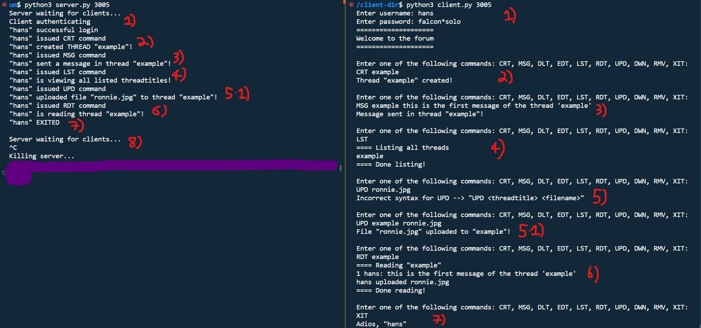
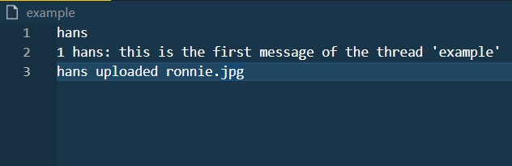

## :electric_plug: Socket Forum :globe_with_meridians:

### A *rushed* terminal-based forum via python3 socket programming

Main files are ***server.py*** (at root directory) and ***client.py*** (inside "*client-dir*" directory).   
Refer to the header comments of these files on how to run the forum.
  
### EXAMPLE:
*NB: Terminal on the left displays the server's responses, whilst the right displays the client's interaction.*

#### 1) 
* Once the server has started, it waits for client communication (via UDP), which is displayed on the right, where the client is started up on the same port number as the server. 
* The client then inputs a correct username and password combo and is taken to the forums. 
* If the wrong combo is provided, 'incorrect password' will be displayed, and if the same password is inserted again, this new user+pass combo will be established (saved into *credentials.txt*).
#### 2)
* On the rhs the client issues the create thread command with the title 'example', of which a physical copy is created (in the server's side), and the client is notified this action was a success. 
* The lhs displays the client requests and its outcome. 
#### 3)
* On the rhs, client successfully posts a message, "this is the first message of the thread 'example'" to the thread 'example'.
#### 4)
* The LST command, which requires no arguments, lists all existing threads, which atm is just 'example'.
#### 5)
* If the wrong the arguments are provided, the correct syntax for the specific command will be displayed, as per 5) on the rhs.
#### 5.1)
* Given that the client has a file on their side, it can be uploaded to the thread (via TCP). Files can also be downloaded from the thread to the client side via *DWN* command. 
#### 6)
* Threads are viewed via *RDT*, which simply reads the thread's contents to the terminal. 
#### 7) , 8)
* Lastly, client logs out via *XIT*, which notifies the server which then reverts its state back to waiting for a new client connection. 

#### Example thread file's contents:

 
 

#### Improvements:
* **Concurrency**
** Support for multiple clients at a time.
* **Persistence**
** Instead of wiping dataStore class when server shuts down, save it into a json file and read from it upon start up.
* **Classes**
** Better to fully implement classes for extensibility, and follow OOP design patterns, such as State Pattern for *Server.py* (waiting for client, authenticating, listening etc.)
* **Improved RDT method**
** Instead of the current sketchy Reliable Data Transfer method (timeouts + global vars), additionally implementing Sequence Number, Checksums and ACKs would solidify the UDP connection against packet loss and corruption, as per [RDT 3.0](https://gaia.cs.umass.edu/kurose_ross/interactive/rdt30.php). This would also allow delegation of some behaviour in *Client.py* to another static helper class, as the current file is too crowded.
* **Organisation of threads**
** Even though threads and its contents are uncessarily physically saved, organising the thread itself and it's uploaded files into its own seperate directory (within Server's root dir) would be much cleaner and clearer, instead of simply saving them into server's root directory.
 

# :octocat:
